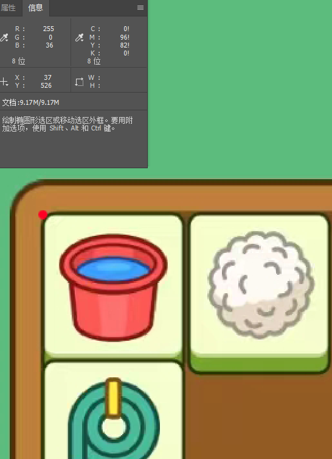
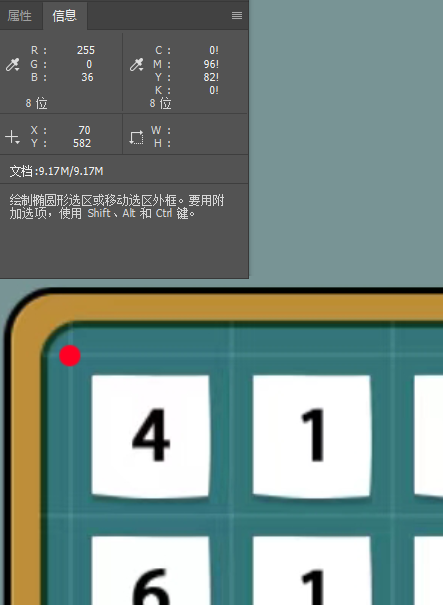
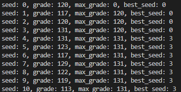
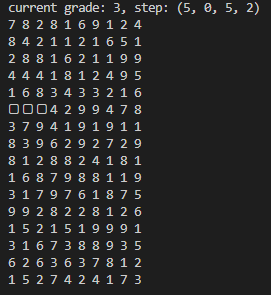
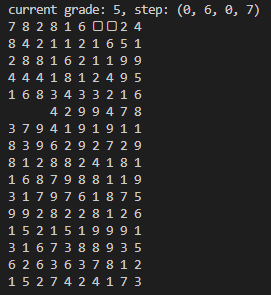
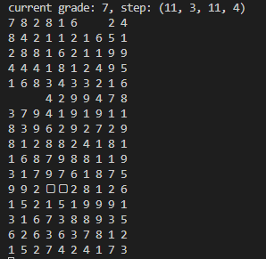
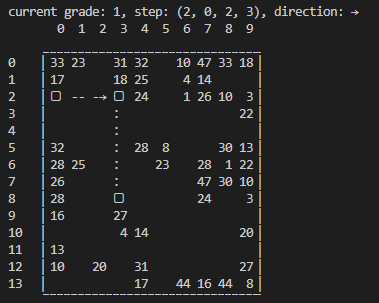
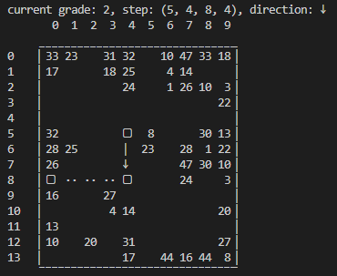
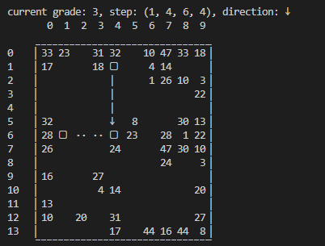

这是一个对微信小程序 无忧托儿所 和 砖了个砖 的外挂，利用随机值能够尽可能求出最优解

首先确保安装了相关的库
```
pip install requirements.txt
```

然后确保手机屏幕的分辨率调整到1200 x 2670，如果调整不了，就比较麻烦，需要手动调整cv_digit.py中的代码
```
pic_range = (69, 585, 1129, 2279)
```
分别表示（左上角x，左上角y，右下角x，右下角y），可以通过ps等软件得到这个坐标点，如下面的图片所示，红色点为砖了个砖左上角的点



下面是无忧托儿所左上角点的位置



接下来还需要把digits目录下和image目录下的图片重新截图

## 无忧托儿所
运行目录下的game.py，设置了100个随机种子，每一个种子迭代50000次，不断尝试四元组（左上角x，左上角y，右下角x，右下角y），每消除几个方块就加几分，得到100个种子中的最大值，然后就可以按照这个种子的方式得到消除的过程

寻找最优解，种子为3，最好成绩131分，理论最优解是10*16=160



然后会依次显示步骤





## 砖了个砖
运行和原理和上面一样，下面是运行的结果，理论最优解是当前方块数除以2



